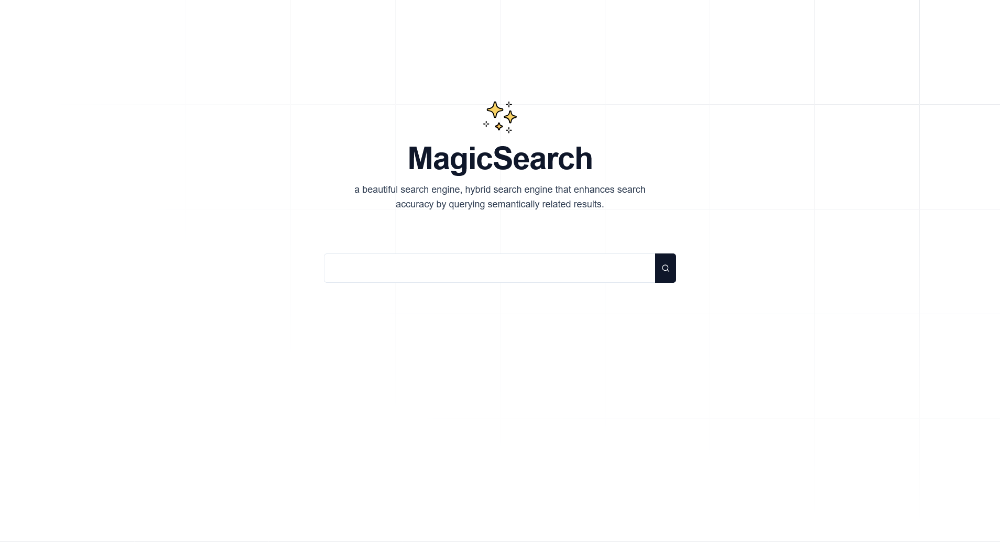

# Search Products Application

A modern web application built with Next.js 15 for searching and managing products efficiently.



## Features

- Server-side rendering with Next.js 15
- Modern UI with Tailwind CSS
- Database integration with NeonDB and Drizzle ORM
- Type-safe development with TypeScript
- Responsive design for all devices
- Fast development with Turbopack

## Tech Stack

- **Framework:** Next.js 15
- **Language:** TypeScript
- **Styling:** Tailwind CSS
- **Database:** NeonDB (Serverless Postgres)
- **ORM:** Drizzle ORM
- **UI Components:** Radix UI
- **Development Tools:**
  - ESLint for code linting
  - Turbopack for fast development
  - PostCSS for CSS processing

## Project Structure

```
searchProducts/
├── src/
│   ├── app/          # Next.js application routes
│   ├── db/           # Database configuration and models
│   └── components/   # Reusable React components
├── public/           # Static assets
├── tailwind.config.ts # Tailwind CSS configuration
├── drizzle.config.ts # Drizzle ORM configuration
└── components.json   # UI components configuration
```

## Getting Started

1. **Clone the repository**

   ```bash
   git clone https://github.com/Lostovayne/searchProducts.git
   cd searchProducts
   ```

2. **Install dependencies**

   ```bash
   npm install
   # or
   bun install
   ```

3. **Environment Setup**
   Create a `.env` file in the root directory with the following variables:

   ```env
   DATABASE_URL=your_neondb_connection_string
   UPSTASH_VECTOR_REST_URL=""
   UPSTASH_VECTOR_REST_TOKEN=""
   ```

4. **Run the development server**

   ```bash
   npm run dev
   # or
   bun dev
   ```

5. **Build for production**
   ```bash
   npm run build
   # or
   bun run build
   ```

## Scripts

- `dev`: Start development server with Turbopack
- `build`: Build the application for production
- `start`: Start the production server
- `lint`: Run ESLint for code linting
- `Drizzle:seed`: Run Seed Database

## Dependencies

### Main Dependencies

- Next.js 15.0.3
- React 19.0.0-rc
- @neondatabase/serverless
- drizzle-orm
- Tailwind CSS
- Radix UI components

### Development Dependencies

- TypeScript
- ESLint
- PostCSS
- drizzle-kit
- Various type definitions

## Contributing

1. Fork the repository
2. Create your feature branch (`git checkout -b feature/AmazingFeature`)
3. Commit your changes (`git commit -m 'Add some AmazingFeature'`)
4. Push to the branch (`git push origin feature/AmazingFeature`)
5. Open a Pull Request

## License

This project is licensed under the MIT License - see the LICENSE file for details.

## Authors

- Deuslovuilt - Initial work

## Acknowledgments

- Next.js team for the amazing framework
- Vercel for the deployment platform
- NeonDB for the serverless database solution
- Upstash for the vector database and embedding model

---

with by Deuslovuilt
